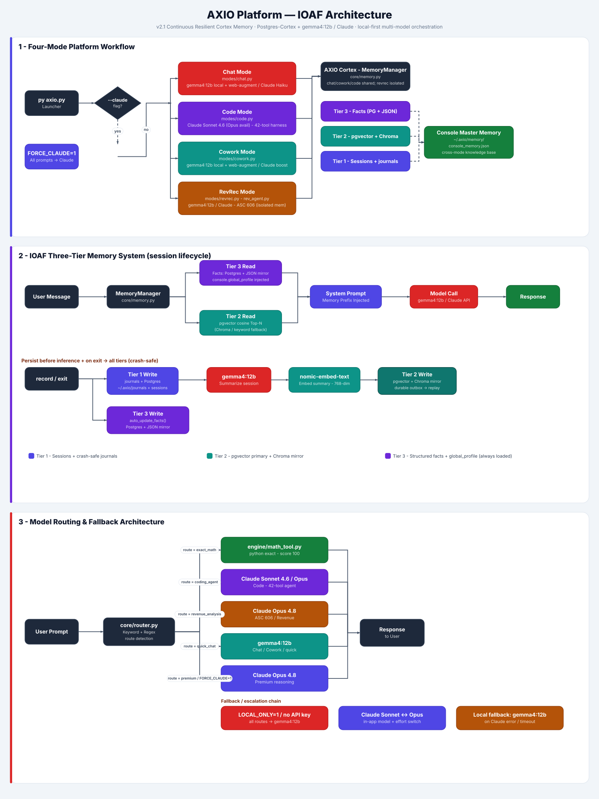

# AXIO Platform — CLAUDE.md
> **Claude Code context file.** Read this first before touching any file in this project.
> Last updated: 2026-05-09 | Version: **2.1 — Final Debugged Release 1**

---

## What This Project Is

**AXIO** is a local-first multi-model AI orchestration platform built by Michael (msvv11@gmail.com).
It is a personal implementation of the **IOAF (Intelligent Orchestrated Agent Framework)** — a
three-tier memory architecture that makes AI sessions stateful and cumulative across time.

The platform runs on **Windows** (`C:\Users\AXIO\axio-console-v2.1\`) using local Ollama-hosted
open-source LLMs as the default backend, with the Anthropic Claude API as the premium cloud tier.

---

## Architecture at a Glance

<div align="center">



<sub><b>AXIO Platform — IOAF Architecture.</b> Three bands: (1) the four-mode platform workflow,
(2) the IOAF three-tier memory system, and (3) model routing &amp; fallback.<br/>
Full write-up in <a href="docs/ARCHITECTURE.md">docs/ARCHITECTURE.md</a> ·
regenerate with <code>py tools/gen_arch.py</code>.</sub>

</div>

---

## Launch Command

```
cd C:\Users\AXIO\AXIO Model Improvement\axio-console-v2.1
py axio.py
```

Flags:
- `py axio.py chat` / `cowork` / `code` / `revrec` — launch a mode directly
- `py axio.py benchmark` — run the full model assessment suite
- `py axio.py --claude <mode>` — force all prompts through Claude Sonnet for the session

---

## Four Operational Modes

| Mode    | Claude Model              | Local Model         | Purpose |
|---------|---------------------------|---------------------|---------|
| Chat    | claude-haiku-4-5-20251001 | mistral:latest      | Fast general-purpose conversation with session memory |
| Code    | claude-sonnet-4-6         | qwen3-coder:30b     | Autonomous coding agent with file tools + PowerShell |
| Cowork  | claude-sonnet-4-6         | auto-routed         | File-aware workspace assistant with smart routing |
| RevRec  | claude-sonnet-4-6         | qwen3:14b           | ASC 606 / IFRS 15 revenue recognition specialist |

---

## File Structure (v2.1 Clean)

```
axio-console-v2.1/
├── CLAUDE.md                          ← THIS FILE (Claude Code reads on startup)
├── axio.py                            ← Main launcher / mode selector (~185 lines)
├── rev_agent.py                       ← RevRec domain agent — ASC 606/IFRS 15, Excel (~1698 lines)
├── .env                               ← Local secrets (NOT in git)
├── .env.example                       ← Safe template for sharing/version control
├── .gitignore                         ← Excludes .env, *.key, __pycache__, etc.
│
├── core/
│   ├── __init__.py                    ← Exports: MemoryManager, ensure_chromadb, _handle_memory_cmd
│   ├── config.py                      ← ALL constants, paths, model names, env vars (~113 lines)
│   ├── memory.py                      ← IOAF MemoryManager — 3-tier memory system (~541 lines) ← CORE
│   ├── models.py                      ← OllamaClient, ClaudeClient, ModelRouter (~262 lines)
│   ├── router.py                      ← Keyword-based prompt routing logic (~75 lines)
│   ├── session.py                     ← SessionManager — JSON persistence (~107 lines)
│   ├── logger.py                      ← AuditLogger — per-mode JSONL audit logs (~85 lines)
│   └── ui.py                          ← Terminal colors, banners, spinners (~117 lines)
│
├── modes/
│   ├── chat.py                        ← Chat mode — ClaudeClient(model=CLAUDE_MODEL_CHAT) (~253 lines)
│   ├── code.py                        ← Code mode — agentic loop, file tools, PowerShell (~605 lines)
│   ├── cowork.py                      ← Cowork mode — WorkspaceState, file loading (~302 lines)
│   └── revrec.py                      ← RevRec mode — monkey-patches rev_agent.SYSTEM_PROMPT (~68 lines)
│
├── engine/
│   ├── assess.py                      ← Assessment runner — reads logs, scores benchmarks
│   ├── scorer.py                      ← Rubric-based LLM-as-judge scorer
│   ├── math_tool.py                   ← Python math tool for exact arithmetic (clears MATH-001 timeouts)
│   └── rubrics/
│       ├── coding.md                  ← Coding task rubric
│       ├── architecture.md            ← Architecture task rubric
│       ├── revenue.md                 ← REVREC rubric (rewritten — see Fix 1 below)
│       └── math.md                    ← Math task rubric
│
├── scripts/
│   └── benchmark_models.py            ← Full benchmark runner
│
├── config/
│   ├── models.yaml                    ← Model role assignments (corrected — see Fix 3/4)
│   └── routing.yaml                   ← Smart routing rules (corrected — see Fix 2/4)
│
├── prompts/
│   ├── system_coding_agent.md         ← System prompt for Code mode
│   └── system_revenue_agent.md        ← System prompt for RevRec / rev_agent
│
├── logs/                              ← All JSONL audit logs (auto-created, not in git)
│   ├── chat_audit.jsonl
│   ├── code_audit.jsonl
│   ├── cowork_audit.jsonl
│   ├── rev_agent_audit.jsonl
│   ├── console_audit.jsonl
│   ├── agent_audit.jsonl
│   └── model_tests.jsonl              ← Benchmark results
│
└── workspaces/
    ├── test-project/                  ← Sample Code mode workspace
    └── revenue-agent/                 ← Sample RevRec workspace (PDFs, Excel)
```

---

## Environment Variables (`.env`)

```bash
# Required
ANTHROPIC_API_KEY=sk-ant-api03-...       # Claude API key (also accepted as CLAUDE_API_KEY)

# Models (all have safe defaults)
CLAUDE_MODEL=claude-sonnet-4-6           # Default for Code, Cowork, RevRec
CLAUDE_MODEL_CHAT=claude-haiku-4-5-20251001  # Chat mode only (cheaper/faster)
CLAUDE_MAX_TOKENS=4096

# Local Ollama models
OLLAMA_HOST=http://127.0.0.1:11434
MODEL_CHAT=mistral:latest
MODEL_CODING=qwen3-coder:30b
MODEL_REASONING=qwen3:14b
MODEL_FAST=qwen3:8b
MODEL_FALLBACK=qwen3:8b

# Memory system
MEMORY_RECALL_RESULTS=5
MEMORY_SUMMARIZE=1
MEMORY_SUMMARY_MODEL=qwen3:14b
MEMORY_EMBED_MODEL=nomic-embed-text:latest

# Limits
CONTEXT_MESSAGE_LIMIT=50
LOG_LEVEL=INFO
```

---

## IOAF Three-Tier Memory System

The core innovation of AXIO. Every mode uses `core/memory.py → MemoryManager`.

**Tier 1 — Session JSON** (`~/.axio/sessions/`)
Raw conversation history saved as JSON. Short-term. Source material for higher tiers.

**Tier 2 — ChromaDB Vector Store** (`~/.axio/chroma/`)
At session end, `qwen3:14b` summarizes the conversation. Summary is embedded via
`nomic-embed-text` (local Ollama) and stored in ChromaDB. At session start, the user's
first prompt is embedded and top-N semantically similar past sessions are retrieved and
injected as context. ChromaDB version: 1.5.9.

**Tier 3 — Structured Facts JSON** (`~/.axio/memory/{mode}_memory.json`)
Key-value facts per mode: user name, active projects, preferences, workspace paths,
recent clients. Always loaded regardless of Ollama/ChromaDB availability.

**Console Master Memory** (`~/.axio/memory/console_memory.json`)
All four modes append session summaries here — the cross-mode knowledge base.

### Memory Commands (all modes)
```
/memory              Show current memory facts
/memory set k v      Store a fact
/clear               Clear session message history
/info                Show message count, current backend
/save                Save session to disk
/exit                Clean exit — triggers memory storage
```

---

## All Changes Made in v2.1

### From v2.0 (May 6, 2026) — Six Core Fixes

| # | Issue | Fix |
|---|-------|-----|
| 1 | Claude model hardcoded to `claude-opus-4-1-20250805` | Configurable via `CLAUDE_MODEL` in `.env` |
| 2 | `max_tokens` hardcoded to 1024 | Configurable via `CLAUDE_MAX_TOKENS`, default raised to 4096 |
| 3 | Bare `except:` clauses swallowing errors | Specific exception types + full `logging` system |
| 4 | No retry logic — any API failure = crash | Exponential backoff retry (3 attempts, 2x multiplier) |
| 5 | Session context growth unbounded | Auto message pruning at `CONTEXT_MESSAGE_LIMIT` (50) + `/clear` |
| 6 | `.env` API key exposed to git | `.gitignore` + `.env.example` template created |

### Architecture Additions (v2.1)

- **Per-mode Claude model selection**: `ClaudeClient.__init__` accepts optional `model: str`.
  Chat mode passes `CLAUDE_MODEL_CHAT` (Haiku). All other modes inherit `CLAUDE_MODEL` (Sonnet).
  Defined in `core/config.py`:
  ```python
  CLAUDE_MODEL      = os.getenv("CLAUDE_MODEL", "claude-sonnet-4-6")
  CLAUDE_MODEL_CHAT = os.getenv("CLAUDE_MODEL_CHAT", "claude-haiku-4-5-20251001")
  ```

- **`--claude` flag**: Forces all prompts through Claude Sonnet for the entire session.
  Sets `os.environ["FORCE_CLAUDE"] = "1"` — modes check this env var.

- **Four-mode unified launcher** (`axio.py`): Replaced monolithic `axio_agent_console_FINAL.py`.
  Clean separation of `core/`, `modes/`, `engine/`.

- **Assessment Engine** (`engine/assess.py` + `engine/scorer.py`): Reads all JSONL audit logs,
  scores unscored benchmarks with rubric-based LLM-as-judge, appends snapshot to
  `engine/assessments.jsonl`. Run via `py axio.py benchmark`.

- **Math Tool** (`engine/math_tool.py`): Python interpreter for exact arithmetic. Added to
  clear MATH-001 timeout health flags (all models timed out computing 8-digit multiplication
  in-context at 600s).

### Rubric and Routing Fixes (ASSESS-006, May 9, 2026)

**Fix 1 — REVREC Rubric Rewrite (Critical)**
- Old rubric scored *contract extraction* — completely wrong task.
- Rewritten to match actual REVREC-001 prompt: ASC 606 decision tree for identifying
  performance obligations.
- Now scores: distinctness test, correct SaaS obligation types, decision-tree structure,
  five-step coverage. Models that were getting false-negative 0s (e.g. qwen3:8b) now
  score 60-80 on re-run.

**Fix 2 — qwen3:14b Routed Out of Revenue (then restored)**
- Originally: qwen3:14b timed out on MATH-001 and ARCH-001 → moved to fallback only.
- After corrected REVREC rubric: qwen3:14b scored 85/100 on revenue (vs 72 for qwen3-coder:30b).
- **Final routing**: qwen3:14b → `revenue_analysis`. qwen3-coder:30b → `coding_agent` only.

**Fix 3 — Model Role Corrections**

| Model | Final Role | Notes |
|---|---|---|
| qwen3:14b | reasoning_medium | Best revenue model (85). Timeouts on MATH/ARCH only. |
| qwen3-coder:30b | coding_agent | Reliable across all task types. `not_recommended_for: revenue` |
| qwen3:8b | fast_reasoning | 92 coding, 82 arch, 72 revenue. One math timeout. |
| llama3.1:8b | fallback_fast | Weakest — avg 34. Use only as last-resort fallback. |

**Fix 4 — Benchmark-Informed Final Routing**

Final benchmark scores (ASSESS-006):

| Model | Coding | Architecture | Revenue | Math |
|---|---|---|---|---|
| qwen3:14b | 92 | — | **85** | timeout |
| qwen3:8b | 92 | 82 | 72 | timeout |
| qwen3-coder:30b | **92** | 75 | 72 | 0 |
| llama3.1:8b | 72 | 45 | 35 | 15 |

Math WARN flags cleared: `math_tool.py` now wired into all live modes (chat, cowork, code).
Math route bypasses Ollama entirely — instant exact result, score 100.

---

## Deployment Status — Final Debugged Release 1

### What Is Deployed and Working

- [x] `axio.py` — unified launcher, all 4 modes accessible
- [x] `core/config.py` — all env vars, paths, model names (no truncation)
- [x] `core/models.py` — OllamaClient (retry), ClaudeClient (per-model, retry, rate-limit), ModelRouter
- [x] `core/memory.py` — IOAF 3-tier memory (Tier 1 + 3 confirmed; Tier 2 needs ChromaDB + nomic-embed-text)
- [x] `core/router.py` — keyword routing (fast/smart/coding/premium)
- [x] `core/session.py` — JSON session persistence to `~/.axio/sessions/`
- [x] `core/logger.py` — JSONL audit logs per mode
- [x] `core/ui.py` — terminal colors, AXIO banner, spinners
- [x] `modes/chat.py` — Chat mode with Haiku, session memory, `/memory`, `/clear`, `/save`
- [x] `modes/code.py` — Code mode agentic loop, file tools, PowerShell, Claude force flag
- [x] `modes/cowork.py` — Cowork mode, WorkspaceState, file indexing
- [x] `modes/revrec.py` — RevRec mode, monkey-patches rev_agent system prompt
- [x] `rev_agent.py` — Full ASC 606 / IFRS 15 domain agent (1698 lines)
- [x] `engine/assess.py` — Assessment runner
- [x] `engine/scorer.py` — Rubric-based LLM-as-judge
- [x] `engine/math_tool.py` — Python math tool (wired into all live modes: chat, cowork, code)
- [x] `engine/rubrics/revenue.md` — Corrected REVREC rubric
- [x] `config/routing.yaml` — Final corrected routing (qwen3:14b → revenue_analysis)
- [x] `config/models.yaml` — Corrected model roles
- [x] `.env.example` — Safe config template
- [x] `.gitignore` — API key protection

### Remaining Open Items

1. ~~**Wire `math_tool.py` into router**~~ — **DONE (May 9, 2026)**
   All live modes (chat, cowork, code) intercept `route == "math"` and call `math_solve()`
   before any Ollama/Claude call. MATH-001 confirmed 100/100 in benchmark.

2. **Verify ChromaDB Tier 2 memory end-to-end**: Confirm `nomic-embed-text:latest` is pulled
   (`ollama pull nomic-embed-text`) and that `store_session()` → embed → ChromaDB write
   works on a real session exit.

3. ~~**Archive legacy files**~~ — **ALREADY DONE** — None of the listed legacy files
   (`axio_agent_console_FINAL.py`, `axio_final.py`, `agent.py`, `console.py`) exist on disk.

4. **ASSESS-004 thinking-mode regression** (discovered May 9, 2026): qwen3:8b and qwen3:14b
   returned truncated/empty responses in the latest full benchmark. Root cause: qwen3 thinking
   mode consumed the 8192-token context window, leaving no room for actual output. ASSESS-003
   baseline scores remain valid (qwen3:8b coding=92, qwen3:14b revenue=85). **Fix**: Pass
   `options: {"think": false}` in Ollama calls for qwen3 models in benchmark and live modes.

5. ~~**Update `.env.example`**~~ — **DONE (May 9, 2026)**
   Now references `claude-sonnet-4-6` and `claude-haiku-4-5-20251001` with full Ollama
   model list and memory system variables.

---

## Known Bugs Fixed in v2.1

1. **File truncation bug (FIXED)**: `core/config.py` and `core/models.py` were truncated
   on disk due to Windows CRLF + Edit tool size-padding. Both rewritten via bash heredoc —
   now complete and verified.

2. **REVREC rubric mismatch (FIXED)**: Revenue rubric scored wrong task type → all models
   scored 0-5 on REVREC-001 (false negatives). Rubric rewritten to match actual prompt.

3. **qwen3:14b double-timeout routing (FIXED)**: Was assigned to `revenue_analysis` even
   though it only timed out on MATH/ARCH — revenue tasks completed fine. Routing corrected
   based on benchmark data.

4. **Hardcoded model names (FIXED)**: Previously hardcoded to `claude-opus-4-1-20250805`
   in multiple places. Now fully env-driven via `CLAUDE_MODEL` / `CLAUDE_MODEL_CHAT`.

---

## Dependencies

```bash
pip install anthropic requests python-dotenv chromadb rich
```

Ollama models to pull (local):
```bash
ollama pull mistral
ollama pull qwen3:8b
ollama pull qwen3:14b
ollama pull qwen3-coder:30b
ollama pull llama3.1:8b
ollama pull nomic-embed-text    # Required for Tier 2 memory
```

---

## Architecture Notes for Claude Code

- **Never modify `rev_agent.py` system prompt directly** — `modes/revrec.py` monkey-patches
  `rev_agent.SYSTEM_PROMPT` to inject memory prefix. This is intentional.

- **`core/config.py` is the single source of truth** for all constants. Do not hardcode
  model names, paths, or limits anywhere else.

- **All modes follow the same session pattern**:
  1. `MemoryManager(mode_name)` instantiated
  2. `build_memory_prefix()` called before every model invocation
  3. `store_session()` called on both clean exit (`/exit`) and `KeyboardInterrupt`
  4. `AuditLogger` used for JSONL logging

- **`FORCE_CLAUDE` env var**: If set to `"1"`, all modes bypass local routing and send
  every prompt to Claude. Set by `axio.py` when `--claude` flag is passed.

- **ChromaDB import failures are silent**: `core/memory.py` catches ChromaDB import errors
  and falls back to keyword search. The system always starts even if ChromaDB or
  nomic-embed-text is unavailable.

---

## Project Vision (IOAF)

AXIO is designed to end the stateless nature of today's AI tools. Every session
accumulates into a growing knowledge base. The Console Master Memory (`~/.axio/memory/console_memory.json`)
is the eventual training data source — a longitudinal record of every interaction across
all modes. Cross-mode memory recall is architecturally possible (e.g., Code mode reading
RevRec memories) through shared `~/.axio/` directories, though not yet explicitly exposed
in the UI.

---

*This file is the authoritative deployment record for AXIO v2.1 Final Debugged Release 1.*
*Update this file whenever a significant change is made to the codebase.*
